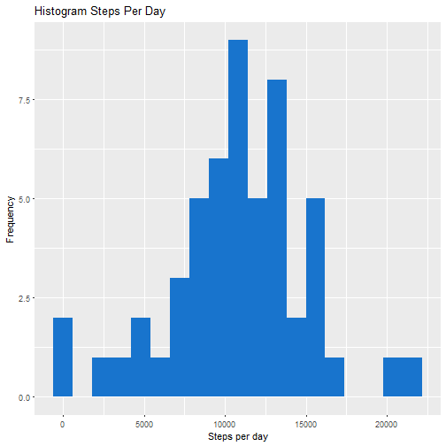
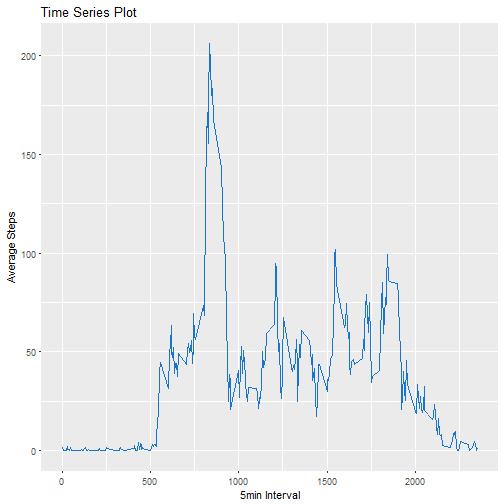
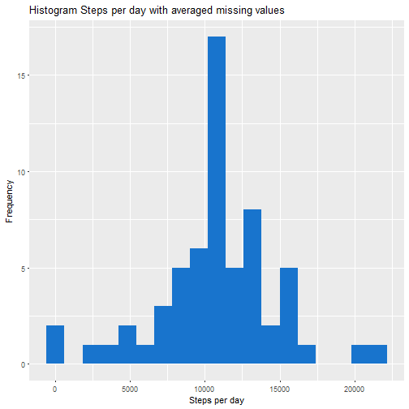
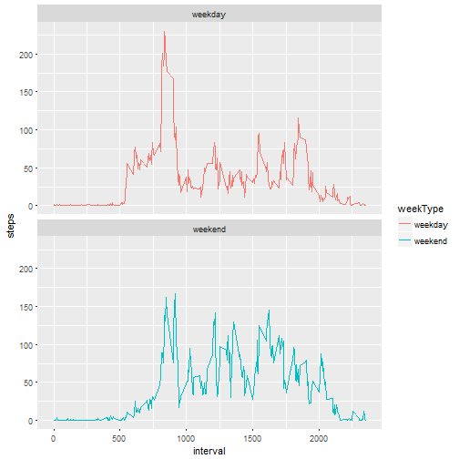

# Reproducible Research Assignemnt - Activity monitoring
Introduction

It is now possible to collect a large amount of data about personal movement using activity monitoring devices such as a Fitbit, Nike Fuelband, or Jawbone Up. These type of devices are part of the "quantified self" movement - a group of enthusiasts who take measurements about themselves regularly to improve their health, to find patterns in their behavior, or because they are tech geeks. But these data remain under-utilized both because the raw data are hard to obtain and there is a lack of statistical methods and software for processing and interpreting the data.

This assignment makes use of data from a personal activity monitoring device. This device collects data at 5 minute intervals through out the day. The data consists of two months of data from an anonymous individual collected during the months of October and November, 2012 and include the number of steps taken in 5 minute intervals each day.

Dataset: Activity monitoring data [52K]
The variables included in this dataset are:  

* ***steps***: Number of steps taking in a 5-minute interval (missing values are coded as NA)  
* ***date***: The date on which the measurement was taken in YYYY-MM-DD format  
* ***interval***: Identifier for the 5-minute interval in which measurement was taken

Required packages:

```r
library(lubridate)
library(dplyr)
library(ggplot2)
```

Download and unzip the file:

```r
if(!file.exists('activity.csv')){
      dir.create("./ActivityMonitoring")
      urlzip <- "https://d396qusza40orc.cloudfront.net/repdata%2Fdata%2Factivity.zip"
      download.file(urlzip, destfile = "./ActivityMonitoring.zip")
      unzip("./ActivityMonitoring.zip", exdir = "./ActivityMonitoring")
}
```


Load the data

```r
activityDT <- read.csv("./ActivityMonitoring/activity.csv")
```

Check the structure and the first six lines of the data

```r
str(activityDT)
```

```
## 'data.frame':	17568 obs. of  3 variables:
##  $ steps   : int  NA NA NA NA NA NA NA NA NA NA ...
##  $ date    : Factor w/ 61 levels "2012-10-01","2012-10-02",..: 1 1 1 1 1 1 1 1 1 1 ...
##  $ interval: int  0 5 10 15 20 25 30 35 40 45 ...
```

```r
head(activityDT)
```

```
##   steps       date interval
## 1    NA 2012-10-01        0
## 2    NA 2012-10-01        5
## 3    NA 2012-10-01       10
## 4    NA 2012-10-01       15
## 5    NA 2012-10-01       20
## 6    NA 2012-10-01       25
```

Set `date` to the appropriate format

```r
activityDT$date <- ymd(activityDT$date)
```
What is mean total number of steps taken per day?
1. Calculate the total number of steps taken per day

```r
stepsPerDay <- activityDT %>% 
      filter(!is.na(steps)) %>%
      group_by(date) %>%
      summarize(steps = sum(steps)) %>%
      print
```

```
## # A tibble: 53 × 2
##          date steps
##        <date> <int>
## 1  2012-10-02   126
## 2  2012-10-03 11352
## 3  2012-10-04 12116
## 4  2012-10-05 13294
## 5  2012-10-06 15420
## 6  2012-10-07 11015
## 7  2012-10-09 12811
## 8  2012-10-10  9900
## 9  2012-10-11 10304
## 10 2012-10-12 17382
## # ... with 43 more rows
```

2. Make a histogram of the total number of steps taken each day

```r
ggplot(stepsPerDay, aes(steps)) +
      geom_histogram(fill = "dodgerblue3", binwidth = 1200) +
      labs(title = "Histogram Steps Per Day", x = "Steps per day", y = "Frequency")
```



3. Calculate and report the mean and median of the total number of steps taken per day
**Mean**

```r
mean(stepsPerDay$steps, na.rm = T)
```

```
## [1] 10766.19
```
**Median**

```r
median(stepsPerDay$steps,na.rm = T)
```

```
## [1] 10765
```


What is the average daily activity pattern?

1. Make a time series plot (i.e. type = "l") of the 5-minute interval (x-axis) and the average number of steps taken, averaged across all days (y-axis)

```r
interval5 <- activityDT %>% 
      filter(!is.na(steps)) %>%
      group_by(interval) %>%
      summarize(meanSteps = mean(steps)) %>%
      print
```

```
## # A tibble: 288 × 2
##    interval meanSteps
##       <int>     <dbl>
## 1         0 1.7169811
## 2         5 0.3396226
## 3        10 0.1320755
## 4        15 0.1509434
## 5        20 0.0754717
## 6        25 2.0943396
## 7        30 0.5283019
## 8        35 0.8679245
## 9        40 0.0000000
## 10       45 1.4716981
## # ... with 278 more rows
```

```r
ggplot(interval5, aes(interval, meanSteps)) +
      geom_line(color = "dodgerblue3") +
      labs(title = "Time Series Plot", x = "5min Interval", y = "Average Steps")
```




2. Which 5-minute interval, on average across all the days in the dataset, contains the maximum number of steps?

```r
interval5[which.max(interval5$meanSteps),]
```

```
## # A tibble: 1 × 2
##   interval meanSteps
##      <int>     <dbl>
## 1      835  206.1698
```

Imputing missing values

1. Calculate and report the total number of missing values in the dataset (i.e. the total number of rows with NAs)

```r
sum(is.na(activityDT$steps))
```

```
## [1] 2304
```

2. Devise a strategy for filling in all of the missing values in the dataset. The strategy does not need to be sophisticated. For example, you could use the mean/median for that day, or the mean for that 5-minute interval, etc.
**Fill in missing NAs with the mean steps of any given interval**

3. Create a new dataset that is equal to the original dataset but with the missing data filled in.

```r
activityDTfull <- activityDT
naDT <- which(is.na(activityDTfull$steps))
meanStepsALL <- tapply(activityDTfull$steps, activityDTfull$interval, mean, na.rm = T, simplify = T)
activityDTfull$steps[naDT] <- meanStepsALL[as.character(activityDTfull$interval[naDT])]

sum(is.na(activityDTfull$steps))
```

```
## [1] 0
```

```r
stepsALL <- activityDTfull %>%
      filter(!is.na(steps)) %>%
      group_by(date) %>%
      summarize(steps = sum(steps)) %>%
      print()
```

```
## # A tibble: 61 × 2
##          date    steps
##        <date>    <dbl>
## 1  2012-10-01 10766.19
## 2  2012-10-02   126.00
## 3  2012-10-03 11352.00
## 4  2012-10-04 12116.00
## 5  2012-10-05 13294.00
## 6  2012-10-06 15420.00
## 7  2012-10-07 11015.00
## 8  2012-10-08 10766.19
## 9  2012-10-09 12811.00
## 10 2012-10-10  9900.00
## # ... with 51 more rows
```

4. Make a histogram of the total number of steps taken each day and Calculate and report the mean and median total number of steps taken per day. 

```r
ggplot(stepsALL, aes(x = steps)) +
      geom_histogram(fill = "dodgerblue3", binwidth = 1200) + 
      labs(title = "Histogram Steps per day with averaged missing values", x = "Steps per day", y = "Frequency")
```



**Mean**

```r
mean(stepsALL$steps)
```

```
## [1] 10766.19
```
**Median**

```r
median(stepsALL$steps)
```

```
## [1] 10766.19
```


Do these values differ from the estimates from the first part of the assignment? What is the impact of imputing missing data on the estimates of the total daily number of steps?
**the mean and the median are equal**


Are there differences in activity patterns between weekdays and weekends?

1. Create a new factor variable in the dataset with two levels - "weekday" and "weekend" indicating whether a given date is a weekday or weekend day.

```r
activityDTfull$weekType <-  ifelse(as.POSIXlt(activityDTfull$date)$wday %in% c(0,6), 'weekend', 'weekday')
```

2. Make a panel plot containing a time series plot (i.e. type = "l") of the 5-minute interval (x-axis) and the average number of steps taken, averaged across all weekday days or weekend days (y-axis). See the README file in the GitHub repository to see an example of what this plot should look like using simulated data.

```r
activityDTfullMean <- activityDTfull %>%
      group_by(interval, weekType) %>%
      summarize(steps = mean(steps)) %>%
      print
```

```
## Source: local data frame [576 x 3]
## Groups: interval [?]
## 
##    interval weekType       steps
##       <int>    <chr>       <dbl>
## 1         0  weekday 2.251153040
## 2         0  weekend 0.214622642
## 3         5  weekday 0.445283019
## 4         5  weekend 0.042452830
## 5        10  weekday 0.173165618
## 6        10  weekend 0.016509434
## 7        15  weekday 0.197903564
## 8        15  weekend 0.018867925
## 9        20  weekday 0.098951782
## 10       20  weekend 0.009433962
## # ... with 566 more rows
```

```r
ggplot(activityDTfullMean, aes(interval, steps, color = weekType)) +
      geom_line() +
      facet_wrap(~ weekType, ncol = 1)
```




